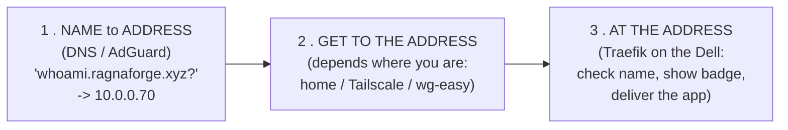
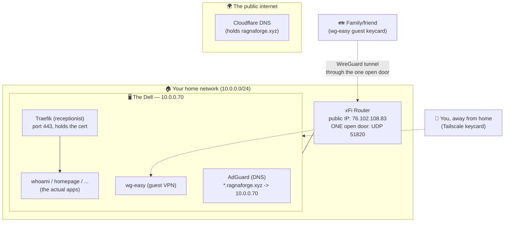
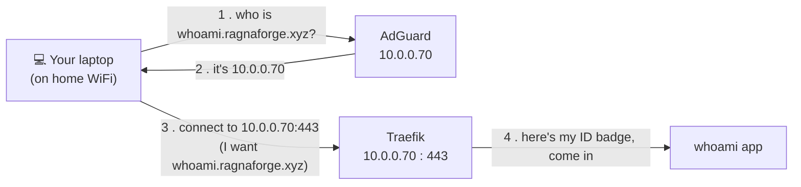
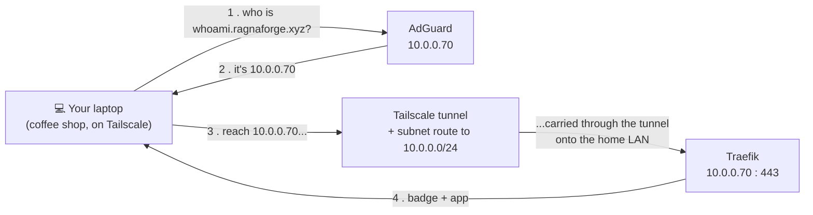
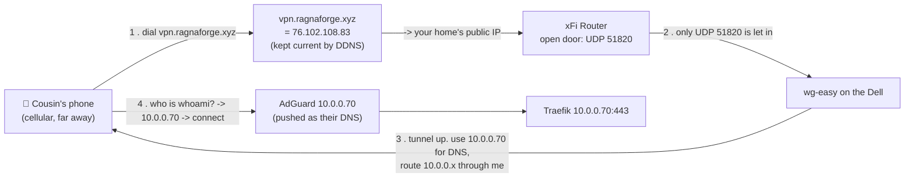
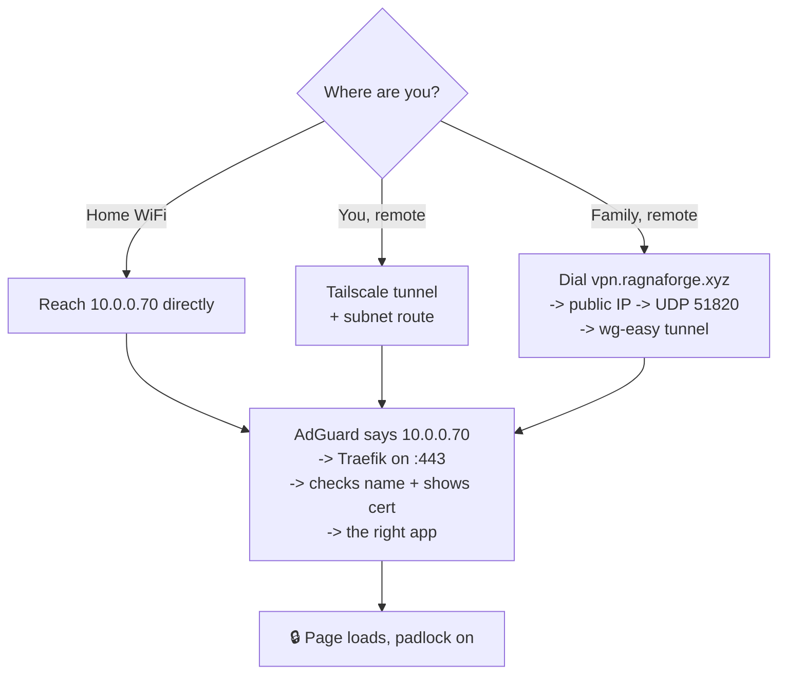

# How the networking works — a plain-English guide

You typed `https://whoami.ragnaforge.xyz` into a browser and a page appeared with a
padlock. This document explains **everything that happened in between** — the DNS,
the two VPNs, the one open port, the certificate — in a way that assumes no
networking background. Read it top to bottom; each section builds on the last.

---

## The big idea, in one sentence

> **A friendly name gets turned into one address (`10.0.0.70`), *something* carries
> you to that address, and a receptionist there checks the name and hands you the
> right app over a secure connection.**

Every scenario below is just a different version of that one sentence.

---

## Meet the players

Everything runs on **one computer — "the Dell"** — whose address on your home
network is **`10.0.0.70`**.

| Piece | What it really is | Everyday analogy |
|---|---|---|
| **Your domain** `ragnaforge.xyz` | A name you own | Your family surname |
| **AdGuard** | **DNS** — turns names into IP addresses | The **contacts app** ("who is X? here's their number") |
| **Traefik** | **Reverse proxy** — one front door for all apps | The **receptionist** who reads the visitor's name tag and walks them to the right office |
| **The wildcard certificate** | Proof the site is really yours | A **tamper-proof ID badge** the browser inspects |
| **Tailscale** | Private VPN for **you** (the owner) | Your **personal keycard** to the building, from anywhere |
| **wg-easy** | Private VPN for **family/friends** | A **guest keycard** you hand out |
| **DDNS** | Keeps your home's public address up to date | Auto-updating the **street sign** when the city renumbers your house |
| **Port forward (UDP 51820)** | The one hole in your home router | A single **guarded door** in the building's outer wall |

Key point: **AdGuard, Traefik, and every app all live on the Dell.** So almost
everything is really "how do I get a request to the Dell, and what does the Dell do
with it."

---

## The 3-step rule that explains everything

Whenever any device loads `whoami.ragnaforge.xyz`, the same three steps happen:

- **Step 1 is always the same:** AdGuard answers **`10.0.0.70`** for *any*
  `*.ragnaforge.xyz` name, to *every* device. One answer for everyone — no
  special cases.
- **Step 2 is the only part that changes** based on where you're sitting.
- **Step 3 is always the same:** the Dell's receptionist (Traefik) takes it from
  there.

The three scenarios below differ **only in Step 2**.

---

## The map

---

## Scenario A — you're at home on the WiFi

The simplest case. Your laptop is already on the same `10.0.0.0/24` network as the
Dell, so once DNS gives it `10.0.0.70`, it can talk to it directly.

**In words:**
1. Laptop asks AdGuard: *"what's the address for `whoami.ragnaforge.xyz`?"*
2. AdGuard replies: **`10.0.0.70`**.
3. Laptop opens a secure connection to `10.0.0.70` on port 443 and says which name
   it wants (`whoami.ragnaforge.xyz`).
4. Traefik presents the certificate (padlock ✅) and forwards to the whoami app.

> **What IP did the browser get?** `10.0.0.70`. It reached it directly because it's
> on the same home network.

---

## Scenario B — you're remote, on Tailscale (the owner's path)

Now you're at a coffee shop. Your laptop is **not** on the home network, so
`10.0.0.70` means nothing to it — that's a *private* address. This is what
**Tailscale** solves.

Tailscale builds a private encrypted tunnel between your devices and the Dell. But
by itself Tailscale only connects the *Tailscale devices* to each other. To let
your laptop reach the whole home network (`10.0.0.0/24`, including `10.0.0.70`), the
Dell **advertises a subnet route** and you **approved it** — that turns the Dell
into a gateway onto the home LAN. (See "Why did I approve the route?" below.)

**In words:** same 3-step rule. The *only* difference from Scenario A is **Step 2**:
your laptop can't touch `10.0.0.70` directly, so Tailscale carries the request
through its tunnel to the Dell, and the approved subnet route lets it land on the
home LAN. No open ports on your router are involved — Tailscale handles its own
connectivity behind the scenes.

> **What IP did the browser get?** Still `10.0.0.70` — but it reached it *through
> the Tailscale tunnel* instead of directly.
>
> **A shortcut for the curious:** there's also a public DNS record that points
> `*.ragnaforge.xyz` at the Dell's *Tailscale* address (`100.76.173.73`). So even a
> Tailscale device that isn't using AdGuard can find the Dell over the tunnel. Same
> destination, slightly different road.

---

## Scenario C — family/friend on the wg-easy VPN

Your non-technical cousin can't be expected to set up Tailscale. So they get
**wg-easy**: you send them a small config file (or a QR code), they tap "connect,"
and they're in. This is the **only** path that involves opening a door to the
public internet.

**In words:**
1. The phone dials `vpn.ragnaforge.xyz`. That name points at your home's **public
   IP** (`76.102.108.83`), kept accurate by **DDNS** (your home IP changes over
   time; DDNS updates the record so the name always finds you).
2. The request hits your router. The router blocks everything **except UDP 51820**,
   which it forwards to wg-easy on the Dell.
3. wg-easy builds the tunnel and *pushes two settings* to the phone: "use
   `10.0.0.70` as your DNS" and "send anything for `10.0.0.x` through this tunnel."
4. Now the phone behaves exactly like a home device: asks AdGuard, gets
   `10.0.0.70`, reaches it through the tunnel, Traefik serves the app.

> **What IP did the browser get?** `10.0.0.70` again — reached through the WireGuard
> tunnel. The public IP (`76.102.108.83`) was only used to *find the front door*;
> once inside, it's the same `10.0.0.70` as everyone else.

---

## Why two VPNs?

They serve two different kinds of people:

| | **Tailscale** | **wg-easy** |
|---|---|---|
| For | **You** (the operator) | **Family / friends** |
| Setup | Install app, log in with your account | Tap-to-import a `.conf` file / QR |
| Open port needed? | **No** (Tailscale is clever about connectivity) | **Yes** — UDP 51820 |
| Best for | Full admin access to everything | Simple "just let me reach the apps" |

You *could* put family on Tailscale too, but it needs accounts and app installs —
too much for a non-technical relative. wg-easy trades one open port for
grandma-friendly onboarding.

---

## Why is only ONE port open — and why UDP 51820?

Your home router is a wall between your network and the internet. **By default,
nothing from outside can get in.** That's good.

To let family's WireGuard reach wg-easy, you open **exactly one door**: **UDP port
51820** (WireGuard's language). Everything else stays sealed:

- Your apps, the dashboard, AdGuard, the admin panels — **none** are reachable from
  the internet. They're only on the LAN and the VPNs.
- We proved this with a port scan: from outside, **only UDP 51820 answers**.

Why is that safe? Because WireGuard on that port is **silent to strangers** — it
doesn't even reply unless you present a valid cryptographic key. An attacker
scanning your IP essentially sees nothing.

---

## Why is the padlock green? (the certificate)

When your browser connects, it demands proof it's *really* talking to
`ragnaforge.xyz` and not an impostor. That proof is a **TLS certificate** — the ID
badge.

- Traefik holds **one wildcard certificate** for `*.ragnaforge.xyz`, issued for
  free by **Let's Encrypt**.
- It was obtained by proving control of the domain via a **DNS challenge** (Let's
  Encrypt said "put this secret code in your Cloudflare DNS"; Traefik did; Let's
  Encrypt checked it and issued the badge). This needs **no open port**, which is
  why it worked before any VPN existed.
- One wildcard covers **every** subdomain, so a brand-new app
  (`newapp.ragnaforge.xyz`) is trusted instantly — no new certificate needed.

Your browser already trusts Let's Encrypt, so it sees a valid badge and shows the
padlock. No warning.

---

## Putting it all together

Three different roads, **one destination** (`10.0.0.70`), **one receptionist**
(Traefik), **one badge** (the wildcard cert). That's the whole system.

---

## Mini-glossary

- **IP address** — a device's number on a network (like `10.0.0.70`). `10.0.0.x`
  addresses are *private* (only meaningful inside your home).
- **DNS** — the system that turns names into IP addresses. AdGuard is our DNS.
- **Public IP** — your home's single address on the internet (`76.102.108.83`),
  assigned by Xfinity; it can change (hence DDNS).
- **CGNAT** — when your ISP *doesn't* give you a real public IP (shares one among
  many homes). It would have blocked the open-port path — we checked, and you have
  a real public IP, so you're fine.
- **Port** — a numbered "channel" on a device (443 = HTTPS, 53 = DNS, 51820 =
  WireGuard). Opening a port on the router = allowing that one channel in.
- **VPN / tunnel** — an encrypted private path that makes a faraway device behave
  as if it's on your home network.
- **Reverse proxy** — one entry point (Traefik) that routes to many apps by name.
- **Subnet route** — telling a VPN "this machine can reach a whole network," so
  remote devices can use it as a gateway (that's the Tailscale route you approved).
- **TLS certificate** — cryptographic proof of a site's identity → the padlock.

---

*Companion to [`docs/CONVENTIONS.md`](./CONVENTIONS.md) (how stacks are built) and
[`docs/runbooks/phase3-edge.md`](./runbooks/phase3-edge.md) (how the edge was
brought up). This file is the "why/how it works"; those are the "how it's built."*
