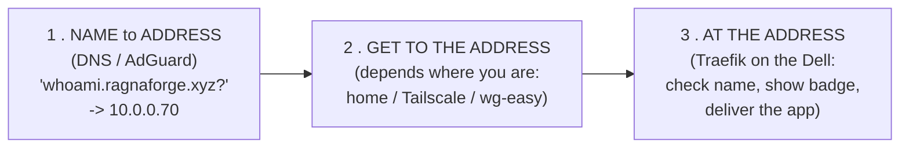
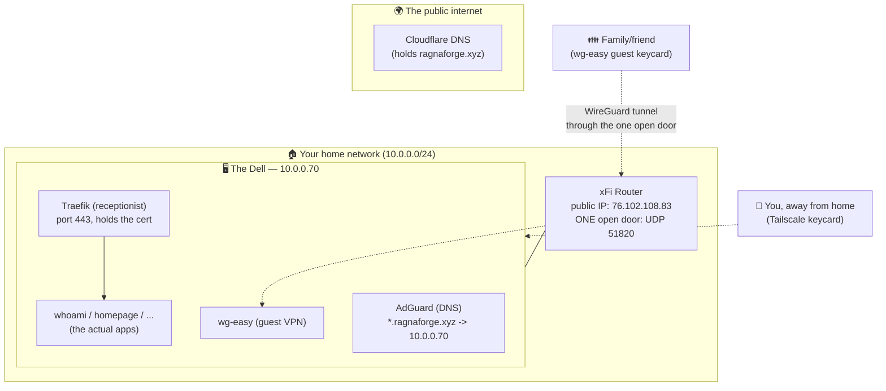
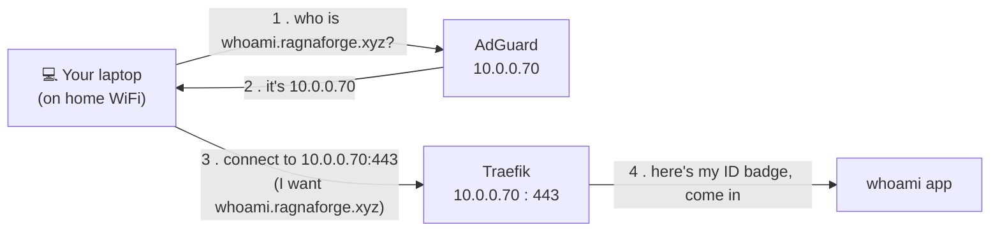
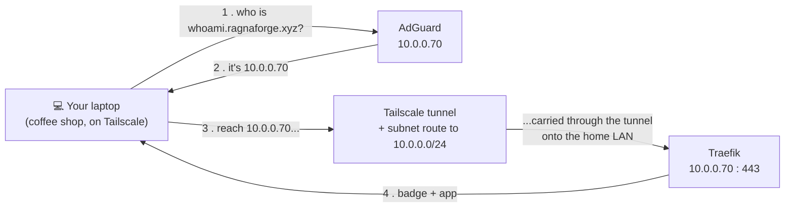
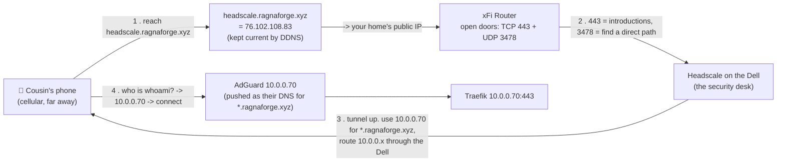
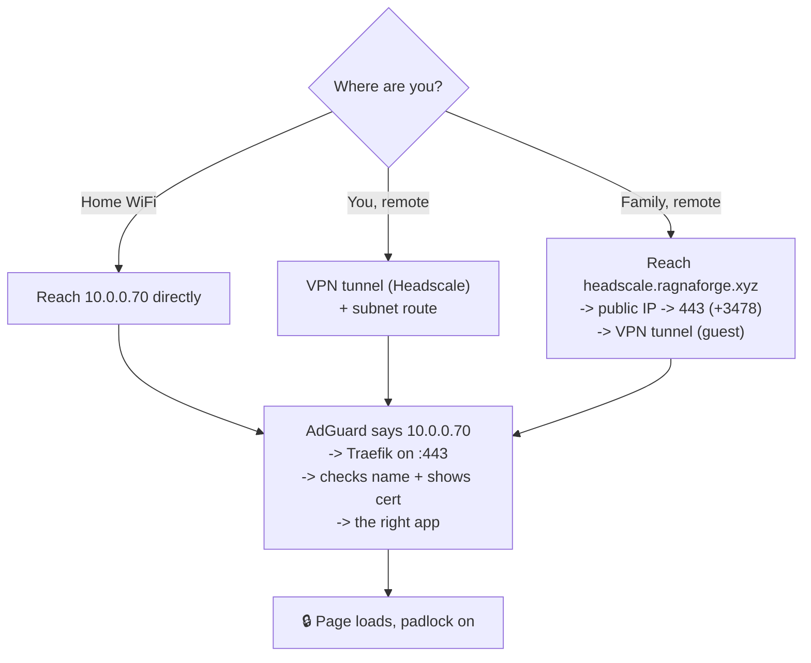

# How the networking works — a plain-English guide

You typed `https://whoami.ragnaforge.xyz` into a browser and a page appeared with a
padlock. This document explains **everything that happened in between** — the DNS,
the two VPNs, the one open port, the certificate — in a way that assumes no
networking background. Read it top to bottom; each section builds on the last.

---

## The big idea, in one sentence

> **A friendly name gets turned into one address (`10.0.0.70`), *something* carries
> you to that address, and a receptionist there checks the name and hands you the
> right app over a secure connection.**

Every scenario below is just a different version of that one sentence.

---

## Meet the players

Everything runs on **one computer — "the Dell"** — whose address on your home
network is **`10.0.0.70`**.

| Piece | What it really is | Everyday analogy |
|---|---|---|
| **Your domain** `ragnaforge.xyz` | A name you own | Your family surname |
| **AdGuard** | **DNS** — turns names into IP addresses | The **contacts app** ("who is X? here's their number") |
| **Traefik** | **Reverse proxy** — one front door for all apps | The **receptionist** who reads the visitor's name tag and walks them to the right office |
| **The wildcard certificate** | Proof the site is really yours | A **tamper-proof ID badge** the browser inspects |
| **Headscale** | Our **own** private-VPN control server on the Dell — everyone (you *and* family) uses it, via the standard Tailscale app | The **security desk** that issues keycards and remembers who's allowed where |
| **Tailscale (the app)** | The client everyone installs; pointed at *our* Headscale, not Tailscale's cloud | The **keycard reader** — same reader for you and for guests |
| **DDNS** | Keeps your home's public address up to date | Auto-updating the **street sign** when the city renumbers your house |
| **Port forwards (TCP 443 + UDP 3478)** | The two holes in your home router that let the security desk work from outside | Two **guarded doors** in the building's outer wall |

Key point: **AdGuard, Traefik, and every app all live on the Dell.** So almost
everything is really "how do I get a request to the Dell, and what does the Dell do
with it."

---

## The 3-step rule that explains everything

Whenever any device loads `whoami.ragnaforge.xyz`, the same three steps happen:

```mermaid
flowchart LR
    A["1 . NAME to ADDRESS<br/>(DNS / AdGuard)<br/>'whoami.ragnaforge.xyz?'<br/>-> 10.0.0.70"]
    B["2 . GET TO THE ADDRESS<br/>(depends where you are:<br/>home / Tailscale / wg-easy)"]
    C["3 . AT THE ADDRESS<br/>(Traefik on the Dell:<br/>check name, show badge,<br/>deliver the app)"]
    A --> B --> C
```

- **Step 1 is always the same:** AdGuard answers **`10.0.0.70`** for *any*
  `*.ragnaforge.xyz` name, to *every* device. One answer for everyone — no
  special cases.
- **Step 2 is the only part that changes** based on where you're sitting.
- **Step 3 is always the same:** the Dell's receptionist (Traefik) takes it from
  there.

The three scenarios below differ **only in Step 2**.

---

## The map

```mermaid
flowchart TB
    subgraph internet["🌍 The public internet"]
        cf["Cloudflare DNS<br/>(holds ragnaforge.xyz)"]
    end

    subgraph home["🏠 Your home network (10.0.0.0/24)"]
        router["xFi Router<br/>public IP: 76.102.108.83<br/>ONE open door: UDP 51820"]
        subgraph dell["🖥️ The Dell — 10.0.0.70"]
            adguard["AdGuard (DNS)<br/>*.ragnaforge.xyz -> 10.0.0.70"]
            traefik["Traefik (receptionist)<br/>port 443, holds the cert"]
            apps["whoami / homepage / ...<br/>(the actual apps)"]
            wg["wg-easy (guest VPN)"]
            traefik --> apps
        end
        router --- dell
    end

    you["📱 You, away from home<br/>(Tailscale keycard)"]
    fam["👪 Family/friend<br/>(wg-easy guest keycard)"]

    you -. "Tailscale tunnel" .-> dell
    fam -. "WireGuard tunnel<br/>through the one open door" .-> router
    router -.-> wg
```

---

## Scenario A — you're at home on the WiFi

The simplest case. Your laptop is already on the same `10.0.0.0/24` network as the
Dell, so once DNS gives it `10.0.0.70`, it can talk to it directly.

```mermaid
flowchart LR
    b["💻 Your laptop<br/>(on home WiFi)"]
    dns["AdGuard<br/>10.0.0.70"]
    tr["Traefik<br/>10.0.0.70 : 443"]
    app["whoami app"]
    b -- "1 . who is whoami.ragnaforge.xyz?" --> dns
    dns -- "2 . it's 10.0.0.70" --> b
    b -- "3 . connect to 10.0.0.70:443<br/>(I want whoami.ragnaforge.xyz)" --> tr
    tr -- "4 . here's my ID badge, come in" --> app
```

**In words:**
1. Laptop asks AdGuard: *"what's the address for `whoami.ragnaforge.xyz`?"*
2. AdGuard replies: **`10.0.0.70`**.
3. Laptop opens a secure connection to `10.0.0.70` on port 443 and says which name
   it wants (`whoami.ragnaforge.xyz`).
4. Traefik presents the certificate (padlock ✅) and forwards to the whoami app.

> **What IP did the browser get?** `10.0.0.70`. It reached it directly because it's
> on the same home network.

---

## Scenario B — you're remote, on the VPN (the owner's path)

Now you're at a coffee shop. Your laptop is **not** on the home network, so
`10.0.0.70` means nothing to it — that's a *private* address. This is what the
**VPN** solves.

You still use the **Tailscale app** — but it now talks to **our own Headscale**
security desk on the Dell (via `--login-server https://headscale.ragnaforge.xyz`),
**not** Tailscale's cloud. It builds a private encrypted tunnel between your devices
and the Dell. But by itself the VPN only connects the *VPN devices* to each other.
To let
your laptop reach the whole home network (`10.0.0.0/24`, including `10.0.0.70`), the
Dell **advertises a subnet route** and you **approved it** — that turns the Dell
into a gateway onto the home LAN. (See "Why did I approve the route?" below.)

```mermaid
flowchart LR
    b["💻 Your laptop<br/>(coffee shop, on Tailscale)"]
    dns["AdGuard<br/>10.0.0.70"]
    ts["Tailscale tunnel<br/>+ subnet route to 10.0.0.0/24"]
    tr["Traefik<br/>10.0.0.70 : 443"]
    b -- "1 . who is whoami.ragnaforge.xyz?" --> dns
    dns -- "2 . it's 10.0.0.70" --> b
    b -- "3 . reach 10.0.0.70..." --> ts
    ts -- "...carried through the tunnel<br/>onto the home LAN" --> tr
    tr -- "4 . badge + app" --> b
```

**In words:** same 3-step rule. The *only* difference from Scenario A is **Step 2**:
your laptop can't touch `10.0.0.70` directly, so the VPN carries the request through
its tunnel to the Dell, and the approved subnet route lets it land on the home LAN.
Getting the tunnel *up* is what the two open ports are for — the security desk
(Headscale) does the introductions on **443**, and **3478** helps your laptop and
the Dell find a direct path (more on both below).

> **What IP did the browser get?** Still `10.0.0.70` — but it reached it *through
> the VPN tunnel* instead of directly.
>
> **Self-hosted, on purpose:** the coordination now runs on *our* Headscale, so the
> tunnel doesn't depend on Tailscale's cloud. (The old Tailscale-cloud login is kept
> installed but switched off, as a one-command fallback.)

---

## Scenario C — family/friend on the VPN

Your non-technical cousin uses the **same VPN you do** — the standard Tailscale app,
pointed at *our* Headscale. You send them **one enrollment key**; in the app they
choose "use a custom server" (`https://headscale.ragnaforge.xyz`), paste the key,
and they're in. They're a **guest**, so the security desk only lets them reach the
apps — not the admin panels.

```mermaid
flowchart LR
    b["📱 Cousin's phone<br/>(cellular, far away)"]
    ddns["headscale.ragnaforge.xyz<br/>= 76.102.108.83<br/>(kept current by DDNS)"]
    door["xFi Router<br/>open doors: TCP 443 + UDP 3478"]
    hs["Headscale on the Dell<br/>(the security desk)"]
    dns["AdGuard 10.0.0.70<br/>(pushed as their DNS for *.ragnaforge.xyz)"]
    tr["Traefik 10.0.0.70:443"]
    b -- "1 . reach headscale.ragnaforge.xyz" --> ddns
    ddns -- "-> your home's public IP" --> door
    door -- "2 . 443 = introductions, 3478 = find a direct path" --> hs
    hs -- "3 . tunnel up. use 10.0.0.70 for *.ragnaforge.xyz,<br/>route 10.0.0.x through the Dell" --> b
    b -- "4 . who is whoami? -> 10.0.0.70 -> connect" --> dns
    dns --> tr
```

**In words:**
1. The app reaches `headscale.ragnaforge.xyz`. That name points at your home's
   **public IP** (`76.102.108.83`), kept accurate by **DDNS** (your home IP changes
   over time; DDNS updates the record so the name always finds you).
2. The request hits your router, which forwards **443** (the security desk does the
   cryptographic introductions and, if needed, relays traffic) and **3478** (helps
   the phone and the Dell punch a **direct** path so traffic doesn't have to be
   relayed). Everything else stays sealed.
3. Once introduced, the tunnel comes up and Headscale *pushes two settings* to the
   phone: "use `10.0.0.70` as your DNS **for `*.ragnaforge.xyz`**" and "send anything
   for `10.0.0.x` through the tunnel."
4. Now the phone behaves like a home device: asks AdGuard, gets `10.0.0.70`, reaches
   it through the tunnel, Traefik serves the app — reliably, even on cellular.

> **What IP did the browser get?** `10.0.0.70` again — reached through the tunnel.
> The public IP was only used to *find the security desk*; once inside, it's the same
> `10.0.0.70` as everyone else.
>
> **Why the switch from the old wg-easy?** WireGuard-on-one-UDP-port kept failing on
> cellular/carrier networks. The VPN can now **fall back to relaying over 443** when a
> direct path is blocked, so "it just connects" — the whole reason for the change.

---

## One VPN, two roles

Everyone is now on **one** system (Headscale + the Tailscale app). The difference is
just **what the security desk lets you reach**:

| | **You (owner)** | **Family / friends (guests)** |
|---|---|---|
| App | Tailscale app → our Headscale | Tailscale app → our Headscale |
| Setup | Log in / enroll your device | Paste one key, pick "custom server" |
| Can reach | **Everything** (apps + admin) | **Only the apps** (`:443`) — not SSH, not admin panels |
| Onboarding | One-time enroll | One key you send; single-use, expires |

The old split (Tailscale for you, wg-easy for family) is gone. One control server,
two permission levels — simpler and more reliable.

---

## Which ports are open — and why 443 + 3478?

Your home router is a wall between your network and the internet. **By default,
nothing from outside can get in.** That's good. The VPN needs exactly **two** doors:

- **TCP 443** — the security desk (Headscale). Every device that wants to join dials
  this to get introduced, prove its key, and — if a direct path can't be built — have
  its traffic **relayed** here. It rides the same `443` as the apps, told apart by
  name, behind the same valid certificate.
- **UDP 3478** — "STUN," a helper that lets two devices behind home routers discover a
  **direct** path to each other. Without it, everything still works but is *relayed*
  through the Dell (slower). With it, most connections go direct.

Everything else stays sealed:

- Your apps, the dashboard, AdGuard, the admin panels — **none** are reachable from
  the internet. Guests on the VPN only get `:443`; admin stuff is owner-only.
- A port scan from outside should answer on **only 443/tcp + 3478/udp** — nothing else.

> **Note on 443:** this is the *first* service we deliberately expose on the internet
> (the old design forwarded only one UDP port). It's safe because the only thing on
> public 443 is the Headscale desk behind a valid certificate, and the router firewall
> stays on its strict default so nothing leaks on IPv6.

---

## Why is the padlock green? (the certificate)

When your browser connects, it demands proof it's *really* talking to
`ragnaforge.xyz` and not an impostor. That proof is a **TLS certificate** — the ID
badge.

- Traefik holds **one wildcard certificate** for `*.ragnaforge.xyz`, issued for
  free by **Let's Encrypt**.
- It was obtained by proving control of the domain via a **DNS challenge** (Let's
  Encrypt said "put this secret code in your Cloudflare DNS"; Traefik did; Let's
  Encrypt checked it and issued the badge). This needs **no open port**, which is
  why it worked before any VPN existed.
- One wildcard covers **every** subdomain, so a brand-new app
  (`newapp.ragnaforge.xyz`) is trusted instantly — no new certificate needed.

Your browser already trusts Let's Encrypt, so it sees a valid badge and shows the
padlock. No warning.

---

## Putting it all together

```mermaid
flowchart TB
    q{"Where are you?"}
    q -- "Home WiFi" --> a["Reach 10.0.0.70 directly"]
    q -- "You, remote" --> b["VPN tunnel (Headscale)<br/>+ subnet route"]
    q -- "Family, remote" --> c["Reach headscale.ragnaforge.xyz<br/>-> public IP -> 443 (+3478)<br/>-> VPN tunnel (guest)"]
    a --> c2
    b --> c2
    c --> c2
    c2["AdGuard says 10.0.0.70<br/>-> Traefik on :443<br/>-> checks name + shows cert<br/>-> the right app"]
    c2 --> done["🔒 Page loads, padlock on"]
```

Three different roads, **one destination** (`10.0.0.70`), **one receptionist**
(Traefik), **one badge** (the wildcard cert). That's the whole system.

---

## Mini-glossary

- **IP address** — a device's number on a network (like `10.0.0.70`). `10.0.0.x`
  addresses are *private* (only meaningful inside your home).
- **DNS** — the system that turns names into IP addresses. AdGuard is our DNS.
- **Public IP** — your home's single address on the internet (`76.102.108.83`),
  assigned by Xfinity; it can change (hence DDNS).
- **CGNAT** — when your ISP *doesn't* give you a real public IP (shares one among
  many homes). It would have blocked the open-port path — we checked, and you have
  a real public IP, so you're fine.
- **Port** — a numbered "channel" on a device (443 = HTTPS / the VPN control desk,
  53 = DNS, 3478 = STUN / direct-path helper). Opening a port on the router =
  allowing that one channel in.
- **Headscale** — our self-hosted copy of Tailscale's coordination server: the
  "security desk" that enrolls devices and enforces who reaches what. Clients are the
  normal Tailscale apps, just pointed at it.
- **STUN / DERP** — STUN (UDP 3478) helps two devices find a **direct** path; DERP is
  the **relay** fallback (over 443) used when a direct path can't be made.
- **VPN / tunnel** — an encrypted private path that makes a faraway device behave
  as if it's on your home network.
- **Reverse proxy** — one entry point (Traefik) that routes to many apps by name.
- **Subnet route** — telling a VPN "this machine can reach a whole network," so
  remote devices can use it as a gateway (that's the Tailscale route you approved).
- **TLS certificate** — cryptographic proof of a site's identity → the padlock.

---

*Companion to [`docs/CONVENTIONS.md`](./CONVENTIONS.md) (how stacks are built) and
[`docs/runbooks/phase3-edge.md`](./runbooks/phase3-edge.md) (how the edge was
brought up). This file is the "why/how it works"; those are the "how it's built."*
